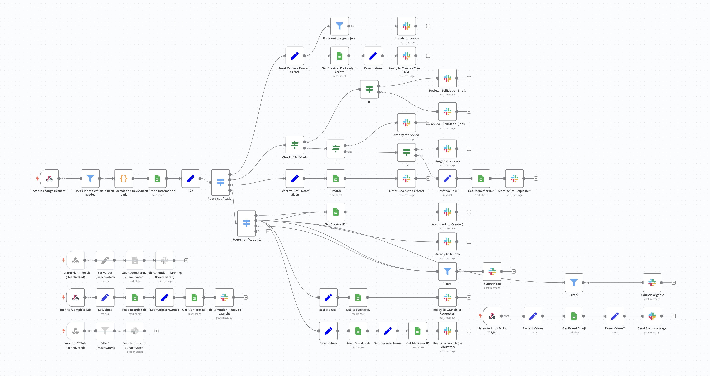
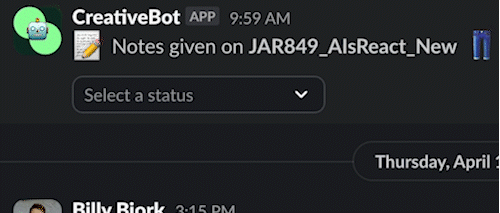
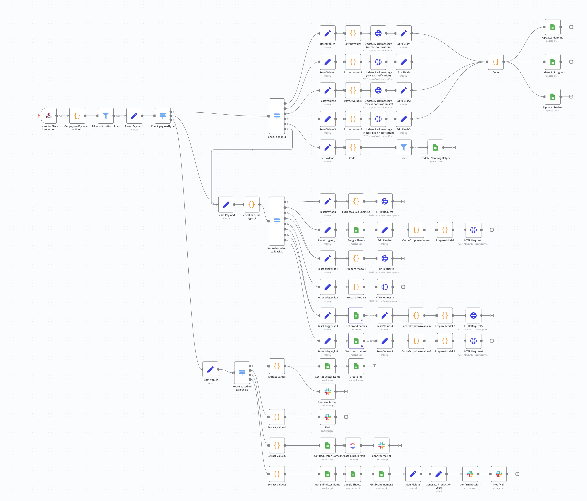
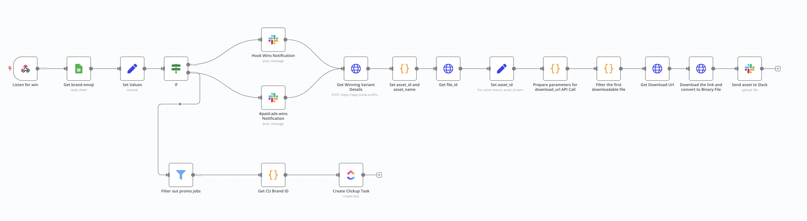
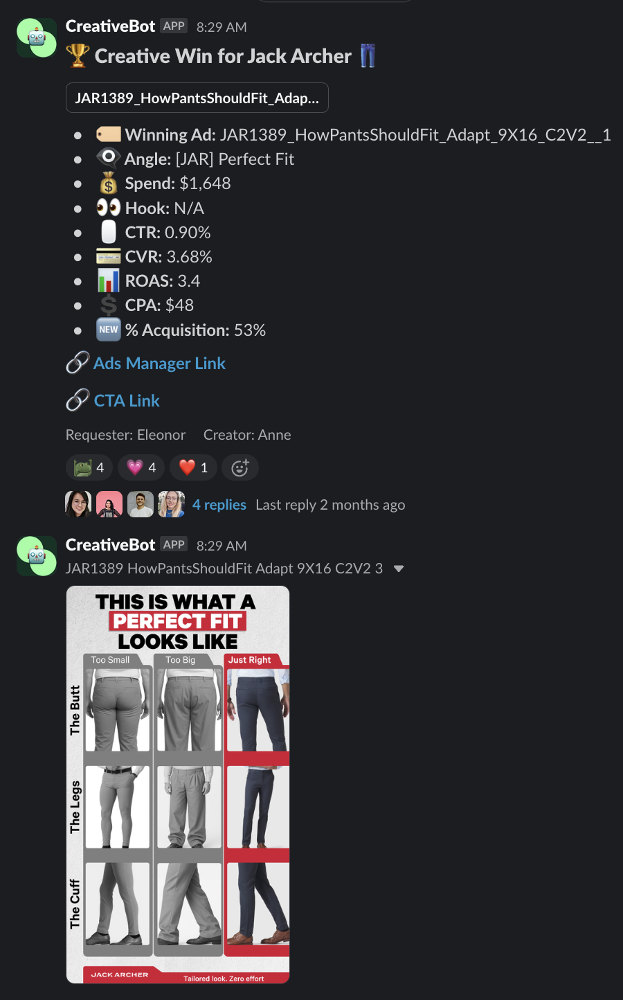

# Creative Operations at OpenStore

This repo represents all technical facets of our comprehensive system for tracking paid ads creation and performance at OpenStore

Challenge was to scale our creative operation to deliver 150+ unique ad creatives per week across 40+ brands

Major focus was automations to save time and invoke standardized next-steps based on ad performance

#### Components:
- Central project management system, responsible for tracking projects in all stages, implementing naming convention, facilitating collaboration between strategists, editors, and designers (see [Creative Sprint Planning](./creative-sprint-planning/))
- Automated Slack notifications triggered by status changes, allowing users to update project statuses from Slack (see [n8n](./n8n/))
- Personal dashboards for browsing ads from entire brand portfolio that have been launched on both Meta and TikTok; filter by brand, creator, or other attributes; sort by metrics like Spend, CTR, ROAS, and more (see [paid-ads-dash](./paid-ads-dash/))

#### Technical Features:
- Google Sheets [Apps Script](https://developers.google.com/apps-script/guides/sheets) functions and triggers, and integrations with external APIs, such as [iconik](https://www.iconik.io/)
- Node-based orchestration for various automations via [n8n](https://n8n.io/), including receiving and parsing webhook payloads from Google Sheets Apps Script and Slack
- Daily data refreshes for platform metrics from Meta and TikTok (see [snowflake](./snowflake/))

***

#### Step 1: Job Creation
A creative project ("job") is added to the Creative Sprint Planning sheet, and its name is generated dynamically as the user inputs information
After changing the status, an Apps Script function adds a job number by auto-incrementing (see [processRowMoves.js](./creative-sprint-planning/core/processRowMoves.js)) - supports batch job creation if needed

#### Step 2: Review Link Generation
After an editor/designer is assigned and has completed a first revision, they export to our media asset management system
From there, a review link can be generated automatically by retrieving assets based on the job name (see [generateReviewLink.js](./creative-sprint-planning/core/generateReviewLink.js))

#### Step 3: Events in Google Sheet Trigger Slack Messages
Google Sheets Apps Script sends payload to n8n, which extracts values and routes to proper Slack message

See [csp-to-slack](n8n/csp-to-slack/) for JSON for building Slack messages

#### Step 4: Interaction with Slack Messages
Once notes have been provided on the initial creatives, the editor/designer receives a notification via Slack, allowing them to update the project status directly from Slack

There are many such interactive notifications like this - see [n8n/csp-to-slack](./n8n/csp-to-slack/)

#### Step 5: Execute Actions Based on Slack Interactions
Interactions with Slack messages send payloads to n8n, routing to proper actions in Google Sheets
Example of user updating a project status directly out of Slack:

n8n receives action payload from Slack, parse values, and update in Google Sheets:

See [slack-to-csp](n8n/slack-to-csp/) for sample code from various nodes

#### Step 6: Browse Metrics and Performance for Live Creative
Once ads are approved and launched into the Meta or TikTok platform, their metrics become available in the Paid Ads Dash

Users can filter by:
- Brand
- Channel (Meta or TikTok)
- Requester (i.e. strategist)
- Creator (i.e. editor/designer)
- Job Format (e.g. Video or Static)
- Job Type (e.g. New, More, Fix, Adapt)
- Date Range (i.e. date ad was launched)
- Wins and Pre-Wins (internal criteria for top-performers)
- Only live ads
In addition to these filters, users can also enter arbitrary search queries, set a minimum spend, and sort by any specific metric (e.g. Spend, CTR, CVR, ROAS, etc.)
See  for formulas to build dash

#### Step 7: Creative Wins Trigger Further Automations
When an ad meets pre-defined internal criteria for becoming a "Win", various actions are triggered:
- Automatically tag the asset as a "Win" in our media asset management system, to support easy filtering/browsing of creative Wins later on (see [setVariantWin.js](./creative-sprint-planning/wins/setVariantWin.js))
- Trigger the creation of a new "Quickscale" job, a placeholder project to iterate on the win (see [wins.js](./creative-sprint-planning/wins/wins.js))
- Send a notification to "#paid-ads-wins" (see [wins.js](./creative-sprint-planning/wins/wins.js) and [n8n/creative-wins](./n8n/creative-wins/)):

Example Slack notification (#paid-ads-wins):
